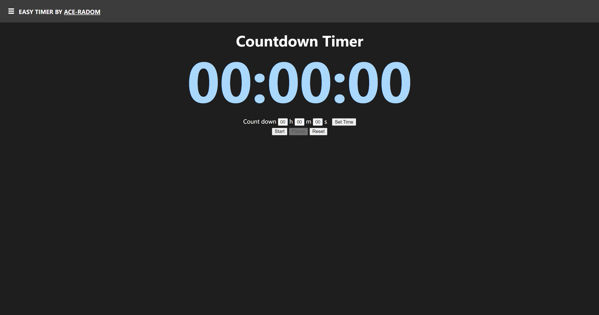

# easytimer

easytimer is a web-based timer without ads

## Functions

easytimer offers a countdown timer and a stopwatch function since v2.0.

The default interface is the timer. If you need to use the stopwatch, open the sidebar and click 'Stopwatch'.

## Interface

## How to use

easytimer currently provides a countdown timer and a stopwatch.

- **Countdown Timer**

    You should set the length of the countdown first, and then click 'Set Time' button.

    After that you can start the timer, pause or reset it as you wish.

- **Stopwatch**

    Just like a normal stopwatch, you can start, pause and reset it.

## Thanks

- [y5nw](https://github.com/y5nw) for UI and js-program updates.